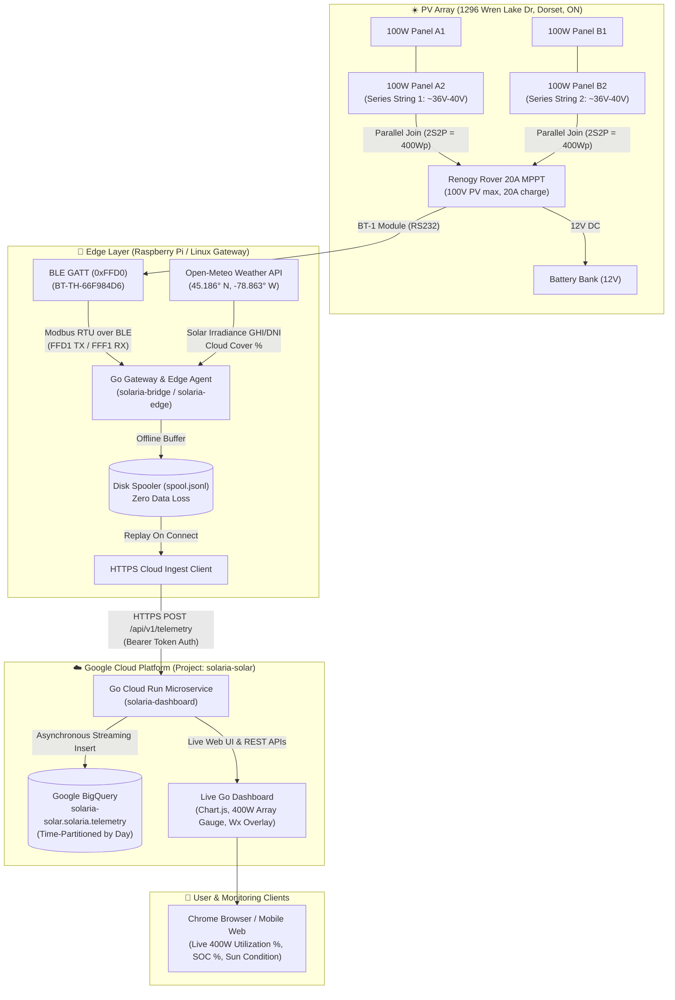

# ☀️ Solaria: Renogy Solar & Atmospheric Intelligence Platform (Go Edition)

An end-to-end, high-performance **Golang** telemetry, weather correlation, and BigQuery analytics platform for Renogy Solar Charge Controllers (Rover, Wanderer, Adventurer) using **BT-1 (RS232)** and **BT-2 (RS485)** Bluetooth Low Energy modules.

---

## 🏛️ System Architecture

---

## ⚡ Solar Array Specifications (4x100W 2S2P)

| Specification | Value | Engineering Notes |
| :--- | :--- | :--- |
| **Total Array Peak Capacity** | **400 Watts Peak ($400\text{Wp}$)** | $4 \times 100\text{W}$ Monocrystalline Panels |
| **Wiring Topology** | **2S2P** | 2 panels in series $\times$ 2 parallel strings |
| **Nominal String $V_{mp}$** | $\approx 36.0\text{V} - 40.8\text{V}$ | High voltage reduces $I^2R$ wire losses and optimizes MPPT tracking buck efficiency |
| **Array Open-Circuit $V_{oc}$** | $\approx 43.2\text{V} - 48.6\text{V}$ | Safely below the Rover 100V DC maximum input rating even in sub-zero winter temperatures |
| **Nominal Array $I_{mp}$** | $\approx 9.8\text{A} - 11.0\text{A}$ | Dual string parallel current well within MC4 and 10AWG wire ratings |
| **Charge Controller** | **Renogy Rover 20A MPPT** | Max 20A charging current to 12V battery bank ($\sim 288\text{W}$ max charging rate) |
| **Over-Paneling Ratio** | **$138\%$ (400W array on 20A controller)** | Ideal for Dorset, ON northern climate: ensures max harvest during cloudy/shoulder hours |

---

## 🧠 Sun Condition & Performance Ratio Engine

Every 10 seconds, telemetry is correlated with live atmospheric physics for Dorset:

- **Array Capacity Utilization %:** $\frac{P_{\text{pv}}}{400\text{W}} \times 100\%$
- **Performance Ratio (PR %):** $\frac{P_{\text{pv}}}{\text{Theoretical Expected Power}} \times 100\%$ where $P_{\text{expected}} = \frac{GHI}{1000\text{W/m}^2} \times 400\text{W}$

| Condition Code | State Name | Criteria | Diagnostic Interpretation |
| :--- | :--- | :--- | :--- |
| `FULL_SUN` | ☀️ Full Sun | $P_{actual} \ge 0.65 \times P_{rated}$ & $GHI > 300 W/m^2$ & Clouds $< 25\%$ | Optimal harvest, unobstructed clear sky |
| `PARTIAL_SUN_OR_SHADE` | ⛅ Partial Sun / Shading | Harvest ratio $< 60\%$ or Cloud Cover $25\text{--}80\%$ | Passing clouds, cloud-edge lensing, or tree shading |
| `DIFFUSE_OVERCAST` | ☁️ Diffuse / Overcast | $GHI < 200 W/m^2$ & $DHI \approx GHI$ & Cloud Cover $> 80\%$ | Flat diffuse lighting through overcast clouds |
| `ABSORPTION_FLOAT_CLIPPED` | 🔋 Float / Clipped | Battery SOC $\ge 99\%$ & State $\in \{\text{Boost}, \text{Float}\}$ | Generation throttled because battery is full |
| `NIGHT` | 🌙 Night / Dark | Solar Elevation $< 0^\circ$ or $PV_{volts} < 5V$ | Panels dormant |

---

## 🗄️ BigQuery Schema (`solaria-solar.solaria.telemetry`)

The schema captures all **34 Modbus registers**, weather observations, and derived analytics:

- `timestamp` (TIMESTAMP, Daily Partitioning)
- `site`, `latitude`, `longitude` (STRING, FLOAT64)
- `array_capacity_w`, `array_topology`, `array_utilization_pct`, `performance_ratio_pct`
- `pv_power_w`, `pv_voltage_v`, `pv_current_a`
- `battery_soc_pct`, `battery_voltage_v`, `battery_current_a`
- `controller_temp_c`, `battery_temp_c`, `charging_state`, `load_status`, `fault_flags`
- `daily_min_battery_voltage_v`, `daily_max_battery_voltage_v`, `daily_max_pv_w`, `daily_generated_wh`
- `operating_days`, `total_battery_fullcharge_count`, `total_charging_ah`, `total_generated_kwh`
- `weather_temp_c`, `weather_cloud_cover_pct`, `weather_direct_rad_w_m2`, `weather_diffuse_rad_w_m2`, `sun_classification`

---

## 🚀 Live Cloud Run Dashboard

- **URL:** [https://solaria-dashboard-952659886764.us-central1.run.app](https://solaria-dashboard-952659886764.us-central1.run.app)
- **Features:**
  - Real-time BigQuery-backed multi-timespan performance analytics (Day, Week, Month, Year)
  - Atmospheric Irradiance ($W/m^2$) & Cloud Cover correlation
  - Battery Voltage (V) & State of Charge (%)
  - Live 400W 2S2P Array Capacity Utilization Gauge
  - System Health & Modbus Alarm Monitor
