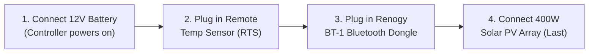

# 🌲 Solaria: Off-Grid Cottage Solar Appliance Setup & Hardware Guide

Welcome to **Project Solaria**, an autonomous edge-to-cloud solar intelligence platform designed for off-grid cottages and cabins (tested at **1296 Wren Lake Drive, Dorset, ON, Canada**).

This guide is designed for **laypersons with zero Linux, zero coding, and zero electrical engineering background**. Following these steps will give you a commercial-grade, self-healing solar monitoring appliance that runs 24/7, recovers automatically from sudden power cuts, and buffers all your data when cottage internet goes down.

---

## 1. Hardware Bill of Materials (BOM)

| Component | Example Model / Specification | Purpose |
| :--- | :--- | :--- |
| **MPPT Solar Controller** | **Renogy Rover 20A / 40A MPPT** | Converts 400W solar panel high voltage to 12V battery charging. |
| **Bluetooth Module** | **Renogy BT-1 or BT-2 (RS232/RJ12)** | Plugs into Renogy Rover RJ12 port; broadcasts live Modbus telemetry over BLE. |
| **Battery Bank** | **12V 170Ah LiFePO4 Lithium Iron Phosphate** | Cottage energy storage ($12.0\text{V}\text{--}14.4\text{V}$). |
| **Solar PV Array** | **400W 2S2P (Two 24V series strings in parallel)** | Generates renewable power ($V_{mp} \approx 36\text{V}, I_{mp} \approx 11\text{A}$). |
| **Edge Monitoring Computer** | **Raspberry Pi Zero 2W, Pi 3B+, Pi 4, or Pi 5** | Runs the autonomous Solaria bridge & SRE supervisor. |
| **Edge Power Supply** | **12V to 5V 3A USB-C Step-Down Buck Converter** | Powers the Raspberry Pi directly from the 12V battery (draws only ~1.5W). |
| **Storage** | **16GB or 32GB High Endurance MicroSD Card** | Flashed with Raspberry Pi OS Lite (64-bit), Debian 12, or Ubuntu 24.04. |

---

## 1.1 Supported Linux Distributions & Automated Resilience Matrix

The 1-click bootstrapper automatically detects and hardens the host operating system against sudden off-grid power loss:

| Operating System | Target Hardware | Automated Installer Hardening Features |
| :--- | :--- | :--- |
| **Raspberry Pi OS Lite (64-bit)** *(Debian Bookworm/Bullseye)* | Raspberry Pi Zero 2W, Pi 3B+, Pi 4, Pi 5 | - `bcm2835_wdt` SoC watchdog loaded & activated<br>- `dtparam=watchdog=on` injected into boot firmware<br>- `systemd-journald` volatile RAM storage (`16MB` cap)<br>- `RuntimeWatchdogSec=15s` hardware timeout<br>- 1-command Read-Only OverlayFS support |
| **Debian 12 "Bookworm" Minimal** | Intel Celeron/N100 Mini PCs, Thin Clients, x86_64 | - x86 hardware watchdog modules (`iTCO_wdt`, `wdat_wdt`) auto-probed<br>- Kernel panic auto-reboot (`kernel.panic=10`, `panic_on_oops=1`)<br>- `vm.dirty_writeback_centisecs=1500` SSD write protection<br>- `Storage=volatile` RAM logging |
| **Ubuntu Server 24.04 LTS Minimal** | x86_64 / ARM64 Small Form Factor Servers | - `systemd-resolved` offline network caching & instant Wi-Fi reconnect<br>- Volatile logging & 15s hardware watchdog integration<br>- Kernel panic auto-reboot |

---

## 2. Strict Safe Wiring Sequence

> [!CAUTION]
> **Renogy Controller Safety Rule:**
> Always connect the **Battery FIRST** before connecting solar panels. Connecting high-voltage solar panels to an unpowered MPPT controller without a battery load can destroy the controller's internal buck converter!



1. **Step 1: Connect LiFePO4 Battery** to the controller's `BATTERY +/-` terminals. The controller screen will light up.
2. **Step 2: Plug in the Remote Temperature Sensor (RTS)** probe attached to the side of your battery.
3. **Step 3: Plug the Renogy BT-1 Dongle** into the controller's `RS232` RJ12 port. The green LED will start blinking.
4. **Step 4: Connect the 400W Solar Panel MC4 cables** to the `SOLAR +/-` terminals last.

---

## 3. 3-Step "Zero-Knowledge" Appliance Installation

### Step A: Flash the MicroSD Card (5 minutes)
1. Insert your MicroSD card into your Mac, PC, or laptop.
2. Download and open the free [Raspberry Pi Imager](https://www.raspberrypi.com/software/).
3. Choose OS: **Raspberry Pi OS (other) $\rightarrow$ Raspberry Pi OS Lite (64-bit)**.
4. Choose Storage: Select your MicroSD card.
5. Click **Next**, then click **Edit Settings (Gear Icon)**:
   - Set Hostname: `solaria`
   - Set Username: `pi` (or your name) and a Password.
   - Configure Wireless LAN: Enter your **Cottage Wi-Fi Name** and **Password**.
   - Enable SSH.
6. Click **Save** and **Write**.

---

### Step B: Power On the Raspberry Pi
1. Insert the flashed MicroSD card into your Raspberry Pi.
2. Connect the 12V $\rightarrow$ 5V USB-C buck converter from your battery bank to the Pi.
3. The green LED on the Pi will start blinking as it boots and joins your cottage Wi-Fi network.

---

### Step C: Run the 1-Click Solaria Bootstrapper
1. Open a terminal or SSH into your Pi (`ssh pi@solaria.local`).
2. Copy and paste this single command:
   ```bash
   curl -sSL https://raw.githubusercontent.com/fkcurrie/solaria/main/deploy/install.sh | sudo bash
   ```
3. The installer automatically:
   - Hardens the Linux OS against SD card corruption during sudden power cuts.
   - Activates the Broadcom hardware watchdog timer (`/dev/watchdog`).
   - Auto-detects your Renogy BT-1 Bluetooth dongle.
   - Starts the background services (`solaria-bridge` and `solaria-sre`).

---

## 4. Accessing Your Dashboard

### At the Cottage (Local Wi-Fi / Offline Mode)
Open any web browser on your phone, tablet, or laptop connected to cottage Wi-Fi:
👉 **`http://solaria.local:8080`** (or `http://192.168.x.x:8080`)

- **100% Offline-Capable**: Even if your satellite or LTE router loses signal for 3 weeks, you can still view live power flow, battery state of charge, and solar harvest on the local cottage network.

### Away from the Cottage (Cloud Dashboard)
When internet is active, all telemetry streams to Google Cloud Run and Google BigQuery:
👉 **`https://solaria-dashboard-952659886764.us-central1.run.app`**

---

## 5. Power Outage, Brownout, & Canadian Winter FAQ

### Q: What happens if DC power cuts abruptly (e.g. battery BMS trips or main switch is flipped)?
**A: Solaria recovers 100% automatically.**
- The Raspberry Pi hardware has no physical soft switch—as soon as 5V DC returns, the board cold-boots immediately.
- The Solaria systemd unit files (`solaria-bridge.service`) start the telemetry gateway within 15 seconds.
- OS logs are stored in RAM (`Storage=volatile`), preventing corrupted log headers or filesystem damage on the SD card.
- If the Linux kernel ever freezes during a power sag, the onboard hardware watchdog timer resets the board after 15 seconds.

### Q: What happens during a 2-week cottage internet outage?
**A: Zero data is lost.**
- The built-in `DiskSpooler` continuously saves telemetry frames to local persistent disk (`telemetry_spool.jsonl`).
- The 50 MB spool quota holds over **30 days of continuous 10-second records**.
- When internet returns, the batch drainer automatically uploads all historical records to Google BigQuery in throttled batches.

### Q: How do I winterize the cottage solar system before departure?
**A: Use the built-in Winterize Assistant (`❄️ Winterize Cottage` tab in the dashboard).**
1. Ensure LiFePO4 battery is between **50% and 60% SOC (13.1V–13.2V)** for optimal cold storage.
2. Verify battery temperature is monitored (charging is automatically inhibited below 0°C to prevent lithium plating).
3. Switch off inverter loads; keep the 12V $\rightarrow$ 5V buck converter and Renogy Rover MPPT active so Solaria continues remote monitoring through the Canadian winter.
