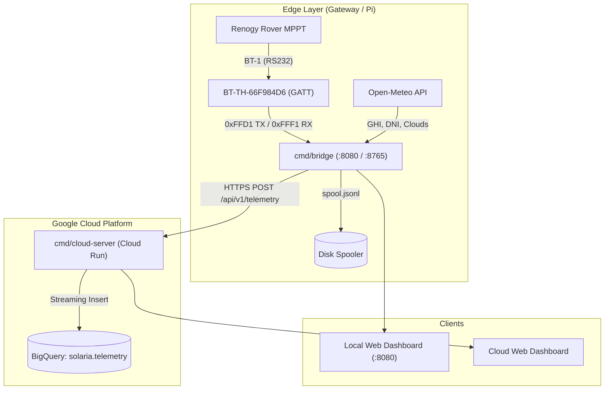

# Architecture

Solaria is structured into three primary layers: an edge ingestion bridge, a cloud ingestion service, and analytical storage in Google BigQuery.



## Components

### Edge Bridge (`cmd/bridge`)

Runs locally on the host machine or Raspberry Pi:

* Hosts the local monitoring UI on `http://localhost:8080` and a WebSocket gateway on `ws://localhost:8765`.
* Manages BLE frame chunking, streaming reassembly, and CRC16 validation.
* Collects ambient irradiance and cloud cover data from the Open-Meteo API at configured intervals.
* Houses the connection watchdog that monitors silence periods and triggers BlueZ host recovery.

### Edge Agent (`cmd/edge-agent`)

A headless daemon for background Linux/Raspberry Pi deployments:

* Connects directly to BlueZ DBus endpoints without requiring a browser session.
* Buffers data to a local append-only spool (`spool.jsonl`) during network partitions.
* Retries uploads to Cloud Run with exponential backoff.

### Cloud Server (`cmd/cloud-server`)

A stateless Go microservice deployed on Google Cloud Run:

* Authenticates incoming edge requests via HTTP Bearer token.
* Performs asynchronous streaming inserts into Google BigQuery.
* Serves the multi-timespan analytics dashboard (Day, Week, Month, Year).

## Communication Protocol

Renogy BT-1 and BT-2 modules expose a custom GATT service carrying Modbus RTU frames over BLE.

### GATT Service Definition

| Characteristic | UUID | Access | Purpose |
| :--- | :--- | :--- | :--- |
| **Command Service** | `0000ffd0-0000-1000-8000-00805f9b34fb` | Service | Service container for command transmission. |
| **Write Characteristic** | `0000ffd1-0000-1000-8000-00805f9b34fb` | Write / Write Without Response | Modbus polling requests sent to controller. |
| **Telemetry Service** | `0000fff0-0000-1000-8000-00805f9b34fb` | Service | Service container for notifications. |
| **Notify Characteristic** | `0000fff1-0000-1000-8000-00805f9b34fb` | Notify / Read | Modbus response stream emitted in 20-byte chunks. |

### Modbus Query Format

To read real-time operating parameters (Registers `0x0100` to `0x0122`, 34 registers total):

```text
[Device ID] [Function] [Start Reg High] [Start Reg Low] [Count High] [Count Low] [CRC Low] [CRC High]
   0x01        0x03          0x01            0x00          0x00         0x22        0x75       0xE6
```

### Response Frame Structure

The controller responds with a 73-byte payload split across multiple BLE notification packets:

* **Byte 0:** Device Address (`0x01`)
* **Byte 1:** Function Code (`0x03`)
* **Byte 2:** Byte Count (`0x44` = 68 bytes)
* **Bytes 3–70:** 34 16-bit register values
* **Bytes 71–72:** CRC16 Checksum (Modbus polynomial `0xA001`, little-endian)
