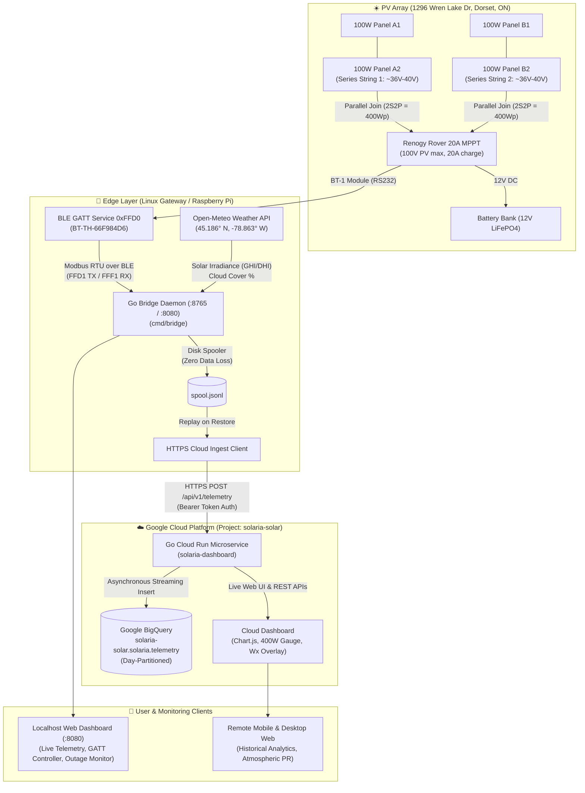

# 🏛️ Solaria System Architecture

Solaria is an end-to-end, high-performance **Golang** telemetry, atmospheric intelligence, and BigQuery analytics platform designed for Renogy Solar Charge Controllers equipped with BT-1 (RS232) or BT-2 (RS485) Bluetooth Low Energy modules.

---

## High-Level Data Flow

---

## Component Breakdown

### 1. Edge Bridge (`cmd/bridge`)
* **Pure Go Server:** Runs on the local host (Linux/macOS/Raspberry Pi) serving the local dashboard on `http://localhost:8080` and a WebSocket control gateway on `ws://localhost:8765`.
* **Modbus RTU Framing & Verification:**
  * Reassembles streaming BLE chunks.
  * Validates Modbus RTU CRC16 checksums before decoding.
  * Handles standard 34-register telemetry blocks (0x0100–0x0122) and battery profile registers (0xE004–0xE012).
* **Autonomous Resilience Supervisor:**
  * Background goroutine monitors telemetry arrival every 5 seconds.
  * Detects disconnections and triggers automatic `bluetooth.service` restarts and `bluetoothctl` power re-engagements.
  * Emits `watchdog_reconnect` signals over WebSocket to initiate Web Bluetooth GATT re-pairing.
* **Outage Tracker & Logger:**
  * Tracks availability percentage, downtime duration, outage count, and session uptime.
  * Streams real-time outage notifications and session history to connected browser clients.

### 2. Standalone Edge Agent (`cmd/edge-agent`)
* Headless background daemon for headless Linux/Raspberry Pi deployments.
* Manages direct BlueZ DBus BLE connections, queries Open-Meteo weather coordinates, buffers data to local disk (`spool.jsonl`), and syncs to Google Cloud Run when online.

### 3. Cloud Server (`cmd/cloud-server`)
* **Google Cloud Run Microservice:**
  * Provides authenticated ingestion endpoint `POST /api/v1/telemetry` with Bearer token authentication.
  * Streams incoming records directly to Google BigQuery asynchronously.
  * Serves server-side rendered dashboard with dynamic timeframes (Day, Week, Month, Year).

---

## BLE & Modbus Communication Specification

* **Primary Service UUID:** `0000ffd0-0000-1000-8000-00805f9b34fb` (Write / Command Channel)
  * **TX Characteristic:** `0000ffd1-0000-1000-8000-00805f9b34fb` (Write Without Response / Write Request)
* **Secondary Service UUID:** `0000fff0-0000-1000-8000-00805f9b34fb` (Read / Notification Channel)
  * **RX Characteristic:** `0000fff1-0000-1000-8000-00805f9b34fb` (Notify / Modbus Response)
* **Standard Polling Query:**
  * Device Address: `0x01`
  * Function Code: `0x03` (Read Holding Registers)
  * Start Register: `0x0100`
  * Register Count: `34` (`0x0022`)
  * Hex Payload: `01 03 01 00 00 22 75 E6`
