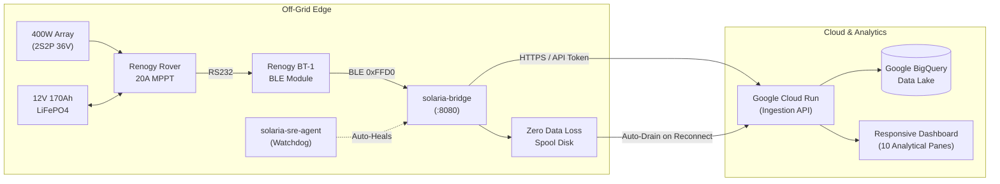

# Solaria: Autonomous Off-Grid Solar Intelligence

  

  <strong>Autonomous Off-Grid Solar & LiFePO4 Energy Intelligence Platform for Renogy MPPT, Raspberry Pi, and Google Cloud Run.</strong>

  
  
  
  
  

---

## ⚡ What is Solaria?

**Solaria** is a resilient, edge-to-cloud telemetry and analytical monitoring system engineered specifically for off-grid remote cottages and standalone power installations.

It bridges low-power hardware controllers (like the **Renogy Rover 20A MPPT**) via **Bluetooth Low Energy (BT-1)** or serial RS485, logs local telemetry with **zero-data-loss disk spooling**, and streams 1-second interval diagnostics to **Google Cloud Run** and **Google BigQuery** for multi-year solar yield forensics and ML generation forecasting.

---

## 🚀 Key System Capabilities

=== "⚡ Real-Time MPPT & Power Budgeting"
    - **1-Second Telemetry Streaming:** Live battery voltage, charging stage (Bulk / Absorption / Float), solar wattage, and MPPT DC-DC conversion efficiency.
    - **Interactive Appliance Power Budget:** Real-time continuous runtime calculator for Starlink ($45\text{W}$), 12V DC Fridge ($30\text{W}$), LED lighting ($15\text{W}$), and water pumps ($60\text{W}$).

=== "🛡️ LiFePO4 Thermal Safety Invariants"
    - **Sub-Zero Charging Inhibit:** Immediate cutoff detection when battery temperature $T \le 0^\circ\text{C}$ ($32^\circ\text{F}$) to prevent permanent lithium dendrite plating and cell damage.
    - **2S2P String Symmetry & Diode Diagnostics:** Real-time array voltage delta analysis detecting bypass diode failures or tree canopy shadow notches.

=== "🌲 Atmospheric Physics & Shading Diagnostics"
    - **NOAA Solar Math Engine:** High-precision calculation of sunrise, solar noon, sunset, and solar elevation angle ($45.186^\circ\text{N}, -78.863^\circ\text{W}$).
    - **Tree Shading Notch Detection:** Identifies morning eastern vs. afternoon western tree shading profiles and calculates seasonal harvest recovery.

=== "🤖 Autonomous Self-Healing SRE Supervisor"
    - **24/7 Watchdog Daemon:** Monitors process memory, goroutines, and packet freshness.
    - **3-Tier Hardware Bluetooth Radio Reset:** Automatically triggers `rfkill unblock`, `hciconfig hci0 reset`, and Bluetooth power cycles if the BLE radio locks up.
    - **Zero-Data-Loss Spooling:** Persistently buffers data to disk during LTE/satellite outages and safely auto-drains upon reconnect.

---

## 📦 Quick Navigation

-   :material-rocket-launch: __[1-Click Quickstart](install/quickstart.md)__

    ---

    Deploy the Solaria edge daemons on Raspberry Pi, Debian, or Ubuntu in under 60 seconds with our curl bootstrap installer.

-   :material-lightning-bolt: __[Wiring & Hardware Setup](install/wiring-guide.md)__

    ---

    Safe 4-step electrical wiring guide for Renogy Rover MPPT, 2S2P solar array, and LiFePO4 battery banks.

-   :material-shield-sun: __[LiFePO4 Chemistry Safety](physics/battery-lifepo4.md)__

    ---

    Deep dive into lithium iron phosphate charge algorithms, sub-zero cold protection, and BMS thresholds.

-   :material-chart-bell-curve: __[Solar & Atmospheric Physics](physics/atmospheric-physics.md)__

    ---

    NOAA solar positioning, diurnal irradiance modeling, and tree shading notch analysis.

-   :material-server: __[Cloud & BigQuery Architecture](software/bigquery-schema.md)__

    ---

    Day-partitioned telemetry schemas, ingestion endpoints, and ML solar yield forecasting.

-   :material-robot: __[Autonomous SRE Supervisor](sre/autonomous-supervisor.md)__

    ---

    Self-healing architecture, automated Bluetooth recovery, and zero-data-loss offline disk spooling.

