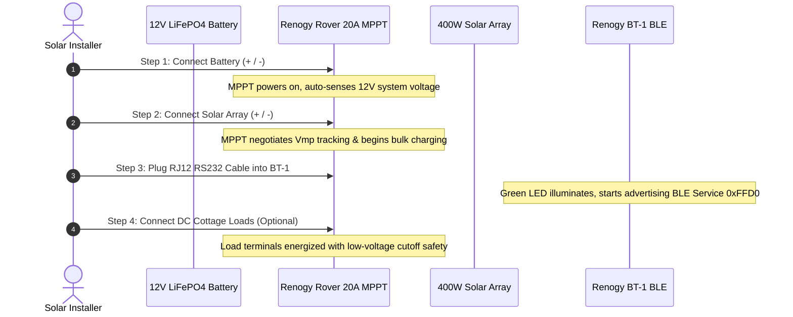

# Safe 4-Step Electrical Wiring Guide

> [!CRITICAL]
> **Order of Connection Invariant:**
> You **MUST ALWAYS** connect the battery bank to the charge controller **FIRST** before connecting the solar panels. Connecting solar panels without battery voltage will permanently destroy the MPPT's internal buck converter transistors.

---

## 🔌 4-Step Connection Sequence

---

## 🛠️ Detailed Step Breakdown

### Step 1: Battery Connection (MANDATORY FIRST STEP)
1. Ensure the inline 40A fuse or DC battery breaker is opened/removed.
2. Connect **Battery Positive (+)** to the Rover's **BATT+** terminal (use 10 AWG or 8 AWG pure copper stranded wire).
3. Connect **Battery Negative (-)** to the Rover's **BATT-** terminal.
4. Insert the fuse or switch the breaker ON.
5. Verify the Rover's LCD display illuminates and reports `12V` system type.

### Step 2: Solar Array Connection (SECOND STEP)
1. Ensure the inline 30A PV DC disconnect switch is in the **OFF** position.
2. Connect the **Solar Array Positive (+)** lead to the Rover's **PV+** terminal.
3. Connect the **Solar Array Negative (-)** lead to the Rover's **PV-** terminal.
4. Switch the PV disconnect switch to **ON**.
5. Observe the PV icon on the Rover LCD flashing as it acquires the Maximum Power Point ($V_{\text{mp}} \approx 36\text{V}$).

### Step 3: Renogy BT-1 Adapter Connection (THIRD STEP)
1. Plug the RJ12 communication cable into the **RS232** port on the bottom of the Rover controller.
2. Connect the other end into the **Renogy BT-1** module.
3. Verify the **PWR** LED on the BT-1 module illuminates solid green.

### Step 4: Disconnection Sequence (INVERTED ORDER)
> [!WARNING]
> When servicing the system, always reverse the sequence:
> 1. **Disconnect Solar Panels FIRST** (Switch PV DC breaker OFF).
> 2. **Disconnect Battery Bank SECOND** (Switch Battery breaker OFF).
