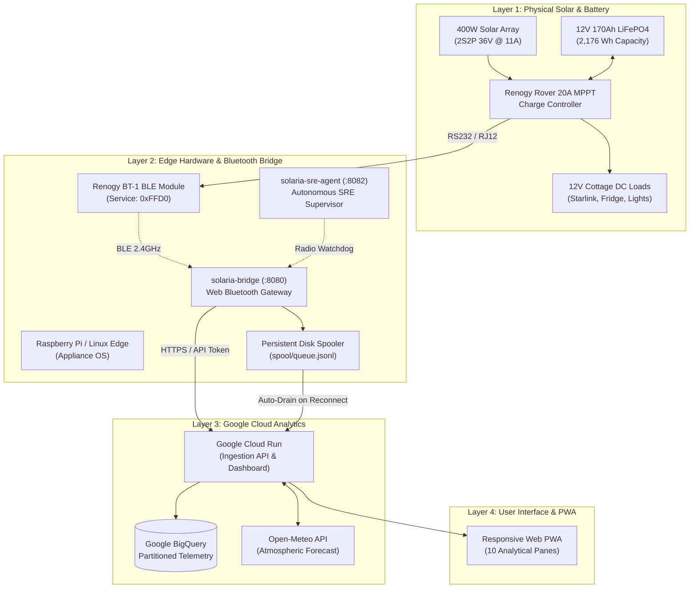

# System Architecture

Solaria is built upon a layered **edge-to-cloud telemetry and analytical architecture**. It guarantees continuous local operation and offline data persistence during network drops, with streaming synchronization to Google Cloud when connectivity is available.

---

## 🏛️ Layered Topology

---

## 🔄 End-to-End Data Flow

1. **Modbus RTU Polling:** The charge controller continuously monitors panel voltage, array current, battery voltage, temperature, and internal charging states.
2. **Bluetooth Low Energy Framing:** The Renogy BT-1 module packages Modbus RTU frames into BLE characteristics under UUID `0000ffd1-0000-1000-8000-00805f9b34fb`.
3. **Edge Bridge Ingestion:** The `solaria-bridge` daemon parses binary frames, computes solar physics invariants (cold derating, string symmetry, DC-DC efficiency), and displays a live ASCII telemetry console.
4. **Resilient Spooling:** If network connectivity to Cloud Run is lost, frames are appended atomically to `spool/queue.jsonl`.
5. **BigQuery Synchronization:** As soon as LTE/WiFi connectivity returns, the spool drainer flushes buffered records in rate-limited batches into Google BigQuery.
6. **Live Analytics & PWA Dashboard:** The single-page dashboard renders 1-second real-time metrics, historical 24-hour diurnal curves, battery health indicators, and power budgeting tools.
