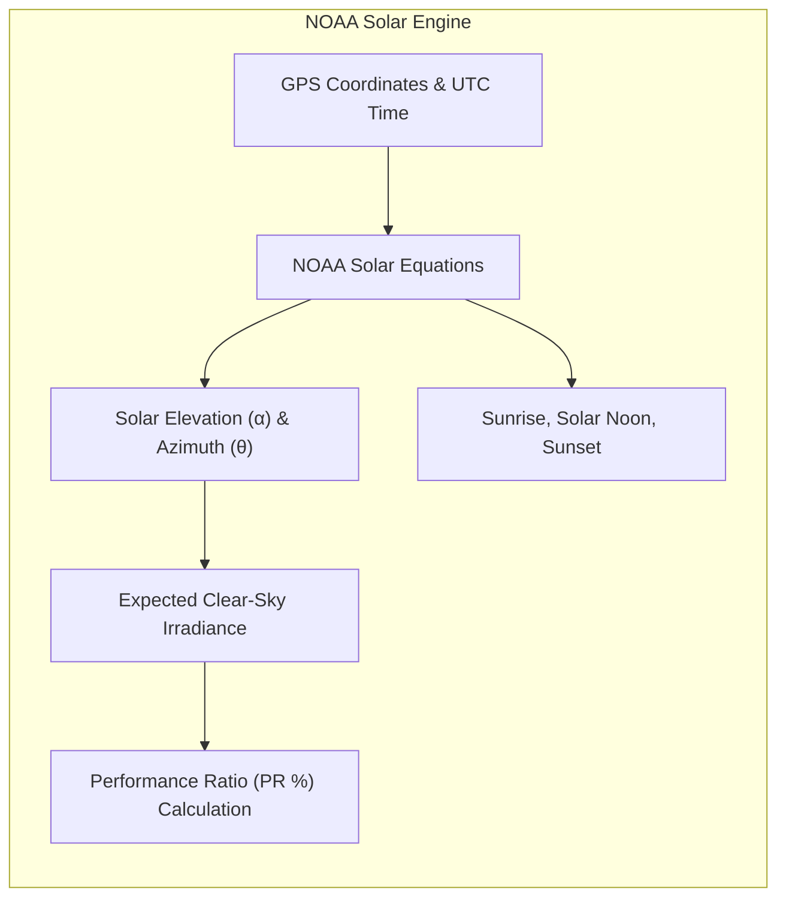

# Atmospheric Irradiance & NOAA Sun Math

Solaria embeds astronomical solar positioning equations derived from the **NOAA Solar Calculator** to predict expected solar harvest at high geographic precision ($45.186^\circ\text{N}, -78.863^\circ\text{W}$, Dorset, Ontario).

---

## 📐 Astronomical Solar Equations

Solaria calculates the exact **Solar Declination ($\delta$)**, **Equation of Time ($\text{EoT}$)**, and **Solar Elevation Angle ($\alpha$)** for every telemetry timestamp:

$$\sin(\alpha) = \sin(\phi) \cdot \sin(\delta) + \cos(\phi) \cdot \cos(\delta) \cdot \cos(\text{HRA})$$

Where:
- $\phi$: Latitude of the installation ($45.186^\circ\text{N}$)
- $\delta$: Solar declination angle based on Day of Year
- $\text{HRA}$: Hour Angle based on Local Solar Time

---

## 📊 Performance Ratio (PR %)

The **Performance Ratio** compares the actual DC power harvested against the theoretical clear-sky irradiance:

$$\text{PR} = \frac{P_{\text{measured}}}{P_{\text{expected}}(\alpha, \text{cloud cover})} \times 100\%$$

- **$\text{PR} \ge 85\%$:** Optimal harvest under clear sky.
- **$40\% \le \text{PR} < 85\%$:** Diffuse or overcast light.
- **$\text{PR} < 40\%$ (High Solar Elevation):** Indicates severe tree shading or panel soiling.
