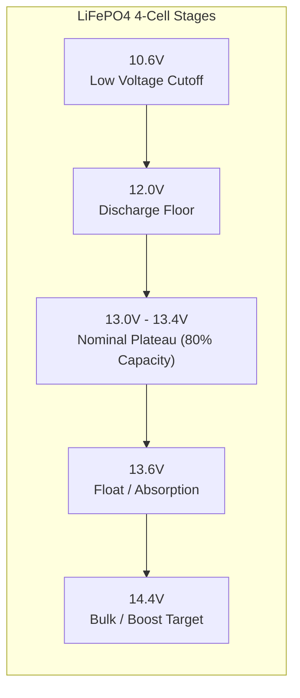

# LiFePO4 Chemistry & Sub-Zero Cold Safety

Lithium Iron Phosphate ($\text{LiFePO}_4$) batteries are the gold standard for off-grid energy storage due to their high thermal stability, long cycle life (>4,000 cycles at 80% DoD), and flat voltage plateau. However, they require precise charging parameters and strict sub-zero temperature protection.

---

## ⚡ Charge Voltage Thresholds (4S 12V Configuration)

| Parameter | 12V Bank (4S) | Per Cell (3.2V Nom) | Description |
| :--- | :--- | :--- | :--- |
| **Bulk / Boost Voltage** | $14.4\text{ V}$ | $3.60\text{ V}$ | Maximum constant-current target voltage |
| **Boost Return Voltage** | $13.2\text{ V}$ | $3.30\text{ V}$ | Voltage drop that triggers a new bulk charging cycle |
| **Float Voltage** | $13.6\text{ V}$ | $3.40\text{ V}$ | Holding voltage to maintain 100% SOC without overcharging |
| **Nominal Plateau** | $13.0\text{ V} - 13.4\text{ V}$ | $3.25\text{ V} - 3.35\text{ V}$ | ~80% of total amp-hour capacity is stored here |
| **Low Voltage Disconnect (LVD)** | $10.6\text{ V} - 11.2\text{ V}$ | $2.65\text{ V} - 2.80\text{ V}$ | Cutoff threshold to protect cells from deep discharge |

---

## ❄️ Sub-Zero Charging Inhibit Invariant

> [!CAUTION]
> **Why Sub-Zero Charging is Dangerous:**
> When a LiFePO4 cell is charged below $0^\circ\text{C}$ ($32^\circ\text{F}$), the lithium ions cannot diffuse quickly into the graphite anode matrix. Instead, they accumulate on the anode surface as metallic lithium dendrites. Over time, these dendrites pierce the cell separator, causing irreversible capacity degradation and internal short circuits.

Solaria continuously asserts this thermal invariant across all edge and cloud layers:

$$\text{If } T_{\text{battery}} \le 0^\circ\text{C} \implies \text{Charge State} = \text{INHIBITED}$$

The `solaria-sre-agent` evaluates this rule every 2 seconds:
- If charging current $I_{\text{charge}} > 0.5\text{A}$ while $T_{\text{battery}} \le 0^\circ\text{C}$, a **CRITICAL_SEVERITY** incident is flagged immediately.
- The UI displays an amber warning banner and alerts the user to check battery thermal wraps or disable charging.
