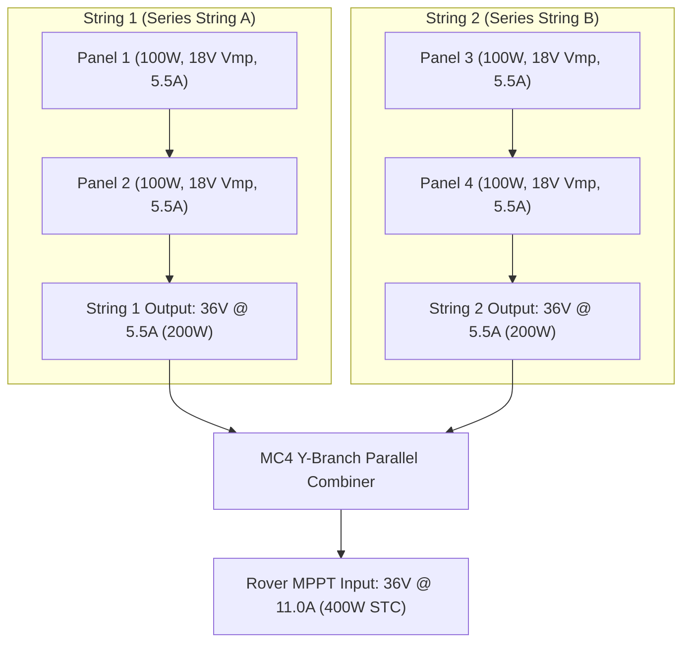

# 2S2P Solar Array & String Topology

A **2S2P (Two Series, Two Parallel)** wiring topology balances voltage efficiency and shading tolerance for a 400W solar array.

---

## ☀️ Array Topology & Electrical Diagram

---

## 🔍 Bypass Diode & String Imbalance Fault Detection

When tree branches or debris shade a single panel in a series string:
1. The shaded panel's internal resistance increases dramatically.
2. The panel's internal **bypass diode** turns ON, bypassing the shaded cells.
3. As a result, the string voltage drops by roughly $18\text{V}$ (one panel drop):

$$V_{\text{array}} \approx 36\text{V} - 18\text{V} = 18\text{V}$$

Solaria's physics engine monitors array operating voltage ($V_{\text{pv}}$):
- **Normal Operating Range:** $32\text{V} - 39\text{V}$ (Both strings fully active).
- **String Fault / Diode Active Band:** $16\text{V} - 22\text{V}$ during peak daylight hours.
- If array voltage persists in the $16\text{V}-22\text{V}$ range when solar elevation $> 30^\circ$, Solaria automatically flags a **Half-String Bypass Diode Fault** incident, isolating the issue to a shaded or failed panel.
