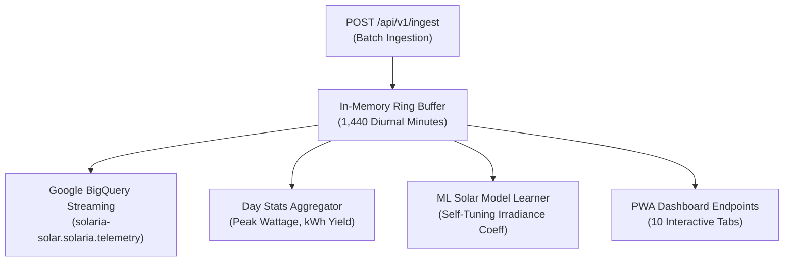

# Cloud Analytics Server (`solaria-cloud-server`)

The **Cloud Analytics Server** is a containerized Go service deployed on **Google Cloud Run** (or run locally on port `8081`). It serves as the telemetry ingestion engine, ML forecasting processor, and Progressive Web App host.

---

## ⚡ Core Engine Capabilities

---

## 📡 Key REST Endpoints (`:8081`)

| Method | Route | Description |
| :--- | :--- | :--- |
| `POST` | `/api/v1/ingest` | High-throughput batch telemetry ingestion endpoint (Auth required) |
| `GET` | `/api/v1/live` | Current live telemetry state with stale detection (< 60s lag) |
| `GET` | `/api/v1/sample-day` | 24-hour diurnal telemetry history (1,440 points) |
| `GET` | `/api/v1/peak-generation-forecast` | ML-driven solar peak hour and daily yield forecast |
| `GET` | `/api/v1/power-budget` | Real-time appliance continuous runtime calculator |
| `GET` | `/api/v1/sun-times` | NOAA astronomical solar angles and daylight countdown |
| `GET` | `/api/v1/shading-analysis` | Diurnal tree canopy shading notch analysis |
| `GET` | `/api/v1/battery-controller-diagnostics` | LiFePO4 operating zone and MPPT efficiency metrics |
| `GET` | `/api/v1/winterize-status` | Cottage winterization readiness and freeze warning checklist |
