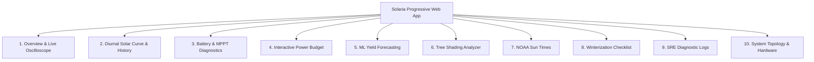

# Mobile Responsive Dashboard (PWA)

Solaria includes a zero-dependency **Progressive Web App (PWA)** styled with a modern off-grid dark theme (`#090d16` background and `#f59e0b` solar amber accents).

---

## 📱 10 Analytical Dashboard Tabs

---

## 📴 Offline PWA Support

- **Service Worker (`/sw.js`):** Automatically caches CSS, SVG icons, and HTML assets for offline execution.
- **Web App Manifest (`/manifest.json`):** Allows "Add to Home Screen" installation on iOS Safari and Android Chrome as a native fullscreen application.
- **Hardware Topology Interactive Cards:** Live indicators for panel string voltage symmetry, battery plateau stage, and controller heatsink thermal status.
