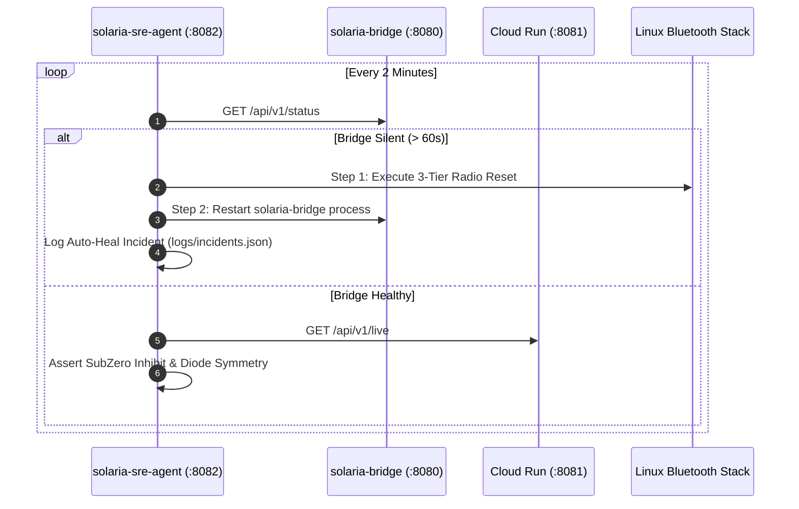

# Autonomous SRE Supervisor (`solaria-sre-agent`)

The **Solaria SRE Supervisor** is an autonomous self-healing agent running on port `:8082`. It continuously executes end-to-end health audits, detects stalled processes, and self-heals system degradation.

---

## 🤖 3-Minute Autonomous Health Cycle



---

## 📋 Forensic Incident Tracking

All incidents are persisted in `logs/incidents.json` with root cause diagnostics and resolution timestamps:

```json
{
  "id": "INC-1787748923514",
  "timestamp": "2026-08-26T12:55:23Z",
  "severity": "HIGH",
  "category": "AUTO_HEAL",
  "title": "Autonomous Bridge Daemon Self-Heal Triggered",
  "description": "Bridge process failed health check; spawned ./bin/solaria-bridge (PID: 781155)",
  "resolved": true
}
```
