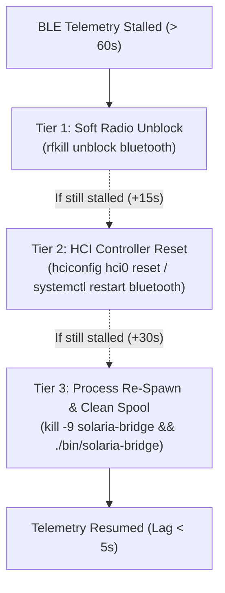

# 3-Tier Hardware Bluetooth Radio Watchdog

Embedded Linux Bluetooth chipsets (e.g., Broadcom BCM43438 on Raspberry Pi) occasionally experience hardware lockups or GATT handle exhaustion when communicating continuously with BLE peripheral modules.

---

## 🛠️ Progressive 3-Tier Reset Algorithm

When the SRE agent detects that no valid BLE frames have been decoded for $> 60\text{ seconds}$, it executes a **progressive 3-tier recovery sequence**:

---

## 🔒 BlueZ Stack Configuration

Solaria configures optimal Bluetooth Low Energy timeouts in `/etc/bluetooth/main.conf`:
- `FastConnectable = true`
- `LEAutoConnect = true`
- `JustWorksRepairing = always`
